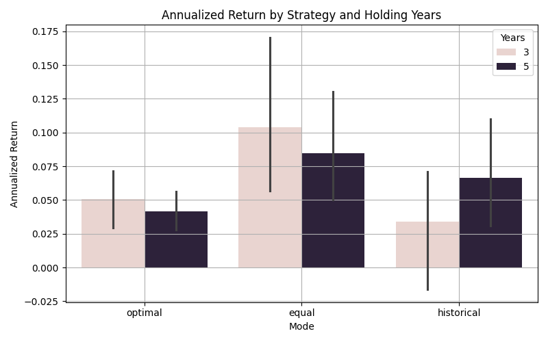

# ETF-Strategy-Backtest
ETF Portfolio Simulation and Analysis
#  ETF 策略模擬分析專案

本專案以 10 檔 Vanguard ETF 為標的，模擬三種投資策略在不同持有年限下的表現：

-  **最適權重投資組合**（Optimal Portfolio）
-  **等權重投資組合**（Equal Weighted Portfolio）
-  **歷史績效回測法**（Historical Performance）

透過模擬與視覺化分析，探討各策略在年化報酬、波動率、Sharpe Ratio 與最大回撤的表現差異。

---

##  專案結構

etf-strategy-backtest/ 
├── scr/ # 所有模組化程式碼 
├── output/ # 成果資料與圖表 
├── main.py # 主程式入口 
├── README.md # 本說明文件 
└── requirements.txt # 套件需求


---

##  執行方式

```bash
# 建立虛擬環境（可選）
python -m venv venv
source venv/bin/activate        # macOS / Linux
venv\\Scripts\\activate         # Windows

# 安裝依賴套件
pip install -r requirements.txt

# 執行主程式
python main.py

```

---

## 📊 模擬成果圖表

### 📈 Sharpe Ratio 各策略比較


### 📈 年化報酬比較



---

## 🧠 分析亮點

- **最適 vs 等權重**：Sharpe Ratio 顯著較高，風險控制優異  
- **長期 vs 短期**：最適策略在 5 年持有下展現更穩定報酬  
- **歷史 vs 最適**：歷史績效僅供參考，未必能有效預測未來市場表現  

📄 詳細文字分析請見：[`output/report.md`](report.md)

---

## 🙋‍♀️ 作者資訊

由 Hazel 製作完成。  
歡迎留言、Fork 或交流討論 🙌
