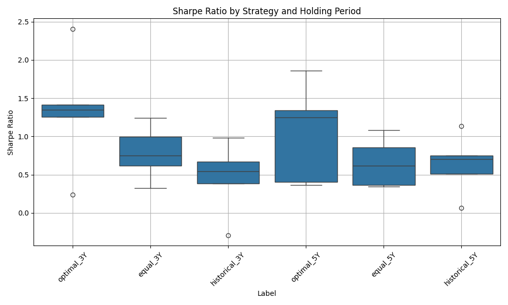
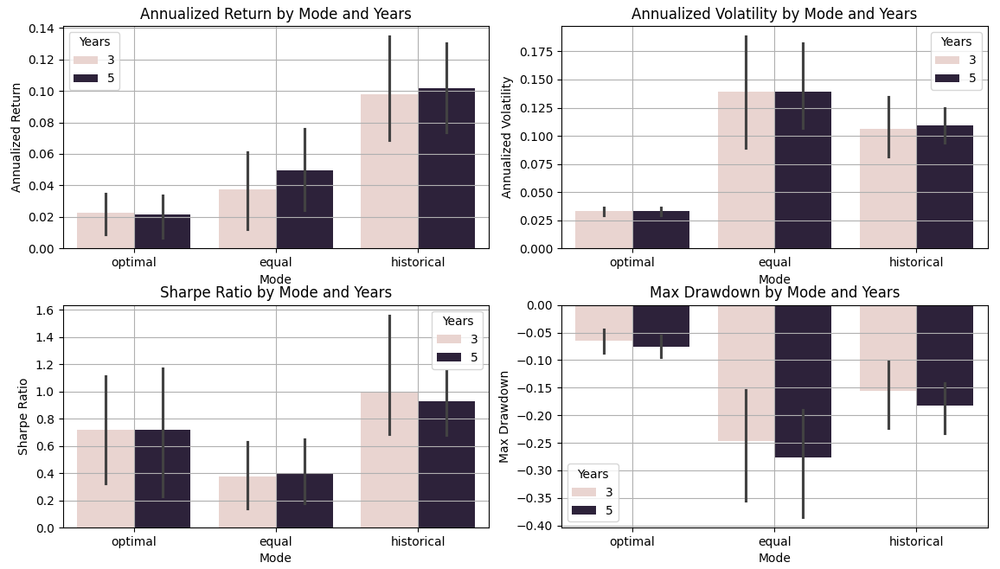

#  ETF 策略模擬分析報告

> 隨機選取 5 個起始日，模擬 10 檔 Vanguard ETF 在不同投資策略與持有期間下的表現，並比較年化報酬率、年化標準差、Sharpe Ratio 與最大回撤等指標。

##  資料與方法說明

- 資料來源：Yahoo Finance 歷史資料

- 使用 ETF 名單（10 檔 Vanguard）：
  - VTSMX（Total Stock Market）
  - VGSIX（Real Estate）
  - VTMGX（Developed Markets）
  - VEIEX（Emerging Markets）
  - NAESX（Small-Cap Index）
  - VIVAX（Large Value）
  - VISVX（Small Value）
  - VIPSX（Inflation-Protected Bonds）
  - VBMFX（Total Bond Market）
  - VFISX（Short-Term Treasuries）

- 報酬計算以週為單位（週報酬率）
- 起始日條件：須有足夠長度歷史資料與未來資料

---

##  策略設計

1. **最適投資組合**（Optimal）：根據最大 Sharpe Ratio 進行資產配置  
2. **等權重組合**（Equal Weight）：每檔 ETF 權重均分  
3. **歷史績效回推法**（Historical）：使用過去績效模擬未來表現  

所有策略皆針對「3 年」與「5 年」兩種持有期間進行模擬，並重複測試 5 次（起始日隨機選擇）

---

## 一、固定持有年限下的策略比較

| 模式 | 年化報酬率 | 波動率 | Sharpe Ratio | 最大回撤 | 分析摘要 |
|------|-------------|---------|---------------|----------|---------|
| 最適 3Y | 中等 | 低 | **高** | 小 | 穩健性最佳 |
| 等權 3Y | 高 | 高 | 中等 | **大** | 高風險高報酬 |
| 歷史 3Y | 不穩定 | 中 | 低至中 | 中偏大 | 預測不準、變異高 |

>  **結論：** 最適策略 Sharpe Ratio 較高，代表在承擔相對較低風險的前提下獲得了較佳報酬。等權報酬雖高，但風險過大不易控管。

---

## 二、持有期間對策略影響

### 最適策略：
- 5 年持有 Sharpe Ratio 明顯改善
- 波動率進一步下降，報酬提升不顯著但更穩定

### 等權策略：
- 報酬略增但 Sharpe Ratio 無明顯提升
- 最大回撤未改善，波動仍大

>  **結論：** 最適策略隨時間越長穩健性提升；等權策略則仍較受市場循環與運氣影響。

---

## 三、預測 vs 真實績效

### 歷史績效法：
- 模擬「用過去推未來」，實測表現不穩定
- 與最適策略相比，Sharpe Ratio 普遍較低
- 多數情境下落後於最適配置組合

> **結論：** 歷史績效模型可能存在過度擬合風險，難以穩定反映未來市場。

---

## 視覺化結果

### Sharpe Ratio 各策略比較  

###  年化報酬、波動率、Sharpe Ratio、最大回撤（3Y vs 5Y）

---

##  策略建議摘要表

| 持有年期 | 策略 | 穩健性 | 報酬潛力 | 適合族群 |
|-----------|--------|-----------|--------------|-------------|
| 3 年 | 最適配置 | 高 | 穩定成長 | 保守或穩健型 |
| 3 年 | 等權配置 | 低 | 潛在高報酬 | 積極型投資人 |
| 5 年 | 最適配置 | **更佳** | 穩健增長 | 長期配置者 |
| 5 年 | 歷史績效 | 不穩定 | 難預測 | 僅作輔助參考 |

---

## ›附註

> - 詳細模擬與指標計算邏輯請參見 `main.py` 與 `scr/` 模組化程式碼  
> - 所有圖表與匯出報表皆可在 `output/` 資料夾中查看

---

📬 有問題歡迎在 [GitHub Repo](https://github.com/Hazels-GitHub/etf-strategy-backtest) 留言討論！

